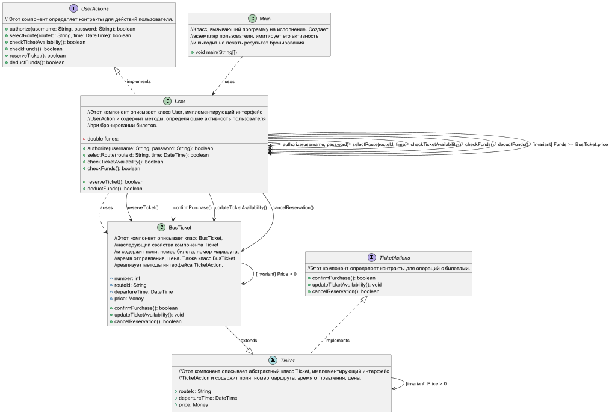

## ПРОЕКТ *"Покупка онлайн билетов на автобус в час пик"*

## 1. ПРЕДУСЛОВИЯ:

Авторизация пользователя: Пользователь должен быть авторизован в системе, чтобы иметь возможность покупки билетов. Это может включать в себя вход с использованием имени пользователя и пароля или других методов аутентификации.

Выбор маршрута и времени: Пользователь должен иметь возможность выбрать конкретный маршрут и время отправления. Это означает, что система должна предоставить пользователю доступ к списку доступных маршрутов и расписанию.

Доступность билетов: Перед покупкой система должна проверить доступность билетов на выбранный маршрут и время. Если билеты распроданы, пользователю должно быть сообщено об этом.

Наличие средств: Пользователь должен иметь достаточное количество средств на своем счете или выбрать удобный метод оплаты.

## 2. ПОСТУСЛОВИЯ:

Бронирование билета: После успешной операции покупки, система должна забронировать выбранный билет на маршрут и время для пользователя. Это гарантирует, что билет не будет доступен для других пользователей.

Списание средств: Если операция прошла успешно, система должна учесть средства пользователя и списать стоимость билета.

Подтверждение покупки: Пользователь должен получить подтверждение о покупке, которое может включать в себя электронный билет или уведомление о покупке.

Обновление доступности билетов: Система должна обновить доступность билетов для данного маршрута и времени, чтобы отразить бронирование.

Отмена бронирования (при необходимости): Если пользователь отменяет операцию покупки, система должна освободить забронированный билет и вернуть средства на счет пользователя.

## 3. ИНВАРИАНТЫ:

User (класс): сумма располагаемых средств пользователя больше, либо равна стоимости билета.
BusTicket (класс): стоимость билета больше нуля.
Ticket (абстрактный класс): стоимость билета больше нуля.

## 4. ОПРЕДЕЛИТЬ АБСТРАКТНЫЕ И КОНКРЕТНЫЕ КЛАССЫ:

Ticket (абстрактный класс)
User (класс)
BusTicket (класс)
Main (класс)

## 5. ОПРЕДЕЛИТЬ ИНТЕРФЕЙСЫ:

UserActions (интерфейс)
TicketActions (интерфейс)

## 6. РЕАЛИЗОВАТЬ НАСЛЕДОВАНИЕ:

BusTicket (класс) EXTENDS Ticket (абстрактный класс)

## 7. ВЫЯВИТЬ КОМПОНЕНТЫ:

UserActions (интерфейс)
TicketActions (интерфейс)
User (класс)
Ticket (абстрактный класс)
BusTicket (класс)
Main (класс)
Всего 6 компонентов.

## 8. РАЗРАБОТАТЬ ДИАГРАММУ КОМПОНЕНТ ИСПОЛЬЗУЯ UML 2.0

## 9. ОПРЕДЕЛИТЬ АЛГОРИТМ ВЗАИМОДЕЙСТВИЯ ГРУППЫ 1 И ГРУППЫ 2 - РАЗРАБОТАТЬ КОНТРАКТ.

User --> BusTicket : reserveTicket();
User --> BusTicket : confirmPurchase();
User --> BusTicket : updateTicketAvailability();
User --> BusTicket : cancelReservation().

## 10. ПОСЧИТАТЬ МЕТРИКИ АБСТРАКТНОСТИ КОМПОНЕНТ.

Метрика абстрактности = (3 / 6) * 100% = 50%
Это означает, что 50% компонентов в проекте являются абстрактными.

## 11. ПРИСВОИТЬ КОМПОНЕНТАМ ВЕРСИЮ ПО ПРИНЦИПУ SemVer.

Версии компонентов:

UserActions (интерфейс), version 1.1.1 
TicketActions (интерфейс), version 1.1.1
User (класс), version 1.1.1
Ticket (абстрактный класс), version 1.0.0
BusTicket (класс), version 1.1.1
Main (класс), version 1.1.0

